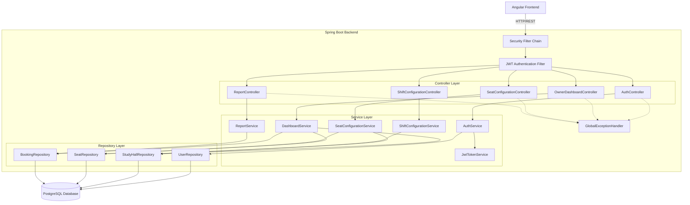
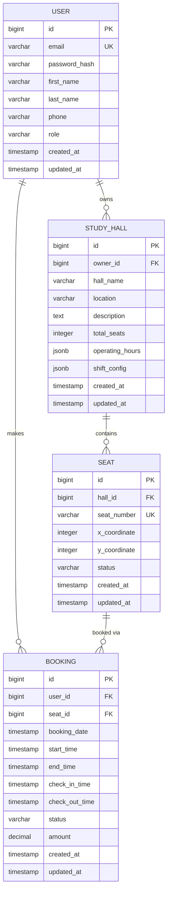
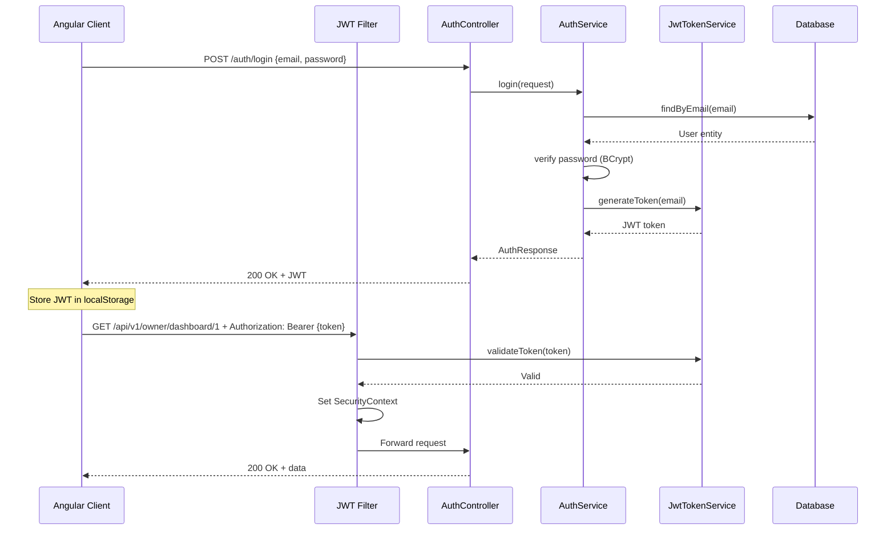

# 🔧 StudyMate Backend Architecture - Detailed Specification

## Document Information

| Field | Value |
|-------|-------|
| **Version** | 1.0.0 |
| **Last Updated** | 2025-10-13 |
| **Status** | Active Development |
| **Author** | Winston (Architect Agent) |

---

## Table of Contents

1. [Introduction](#introduction)
2. [High-Level Architecture](#high-level-architecture)
3. [Technology Stack](#technology-stack)
4. [Service Architecture](#service-architecture)
5. [Data Layer](#data-layer)
6. [API Layer](#api-layer)
7. [Security Architecture](#security-architecture)
8. [Error Handling & Validation](#error-handling--validation)
9. [Testing Strategy](#testing-strategy)
10. [Performance & Scalability](#performance--scalability)
11. [Deployment Architecture](#deployment-architecture)

---

## Introduction

### Purpose

This document provides a comprehensive specification of the StudyMate backend architecture. It serves as the definitive guide for backend development, ensuring consistency, maintainability, and adherence to Spring Boot best practices.

### System Overview

StudyMate is a study hall booking and management platform built with **Spring Boot 3.5.6** and **Java 17**. The backend follows a **layered architecture pattern** with clear separation of concerns across controller, service, repository, and model layers.

### Architectural Goals

- **Separation of Concerns**: Clear boundaries between layers
- **Maintainability**: Easy to understand, modify, and extend
- **Testability**: Comprehensive test coverage at all layers
- **Scalability**: Designed for growth and increased load
- **Security**: Defense-in-depth with JWT authentication and role-based authorization
- **Performance**: Optimized database queries and efficient resource utilization

---

## High-Level Architecture

### Architecture Style

**3-Tier Layered Architecture** with the following tiers:

```
┌────────────────────────────────────────────────────────────┐
│                    Presentation Tier                        │
│                  (REST API Controllers)                     │
│                                                              │
│  AuthController | OwnerDashboardController |                │
│  SeatConfigController | ReportController | etc.             │
└──────────────────────┬─────────────────────────────────────┘
                       │
┌──────────────────────▼─────────────────────────────────────┐
│                     Business Logic Tier                     │
│                    (Service Layer)                          │
│                                                              │
│  AuthService | DashboardService | SeatConfigService |       │
│  ReportService | UserService | etc.                         │
└──────────────────────┬─────────────────────────────────────┘
                       │
┌──────────────────────▼─────────────────────────────────────┐
│                      Data Access Tier                       │
│              (Repository Layer + Database)                  │
│                                                              │
│  UserRepository | StudyHallRepository | SeatRepository |    │
│  BookingRepository → PostgreSQL Database                    │
└────────────────────────────────────────────────────────────┘
```

### Component Diagram



### Package Structure

```
com.studymate.backend/
├── StudymateBackendApplication.java    # Spring Boot main class
│
├── controller/                         # REST API Endpoints (Presentation Layer)
│   ├── AuthController.java                 - Authentication & Registration
│   ├── OwnerDashboardController.java       - Dashboard metrics
│   ├── SeatConfigurationController.java    - Seat layout management
│   ├── ShiftConfigurationController.java   - Operating hours management
│   ├── ReportController.java               - Report generation
│   ├── UsersController.java                - User management (dev/testing)
│   ├── HealthController.java               - Health check endpoint
│   └── package-info.java
│
├── service/                            # Business Logic (Service Layer)
│   ├── AuthService.java                    - Authentication interface
│   ├── AuthServiceImpl.java                - Authentication implementation
│   ├── UserService.java                    - User management interface
│   ├── UserServiceImpl.java                - User management implementation
│   ├── DashboardService.java               - Dashboard metrics aggregation
│   ├── SeatConfigurationService.java       - Seat CRUD operations
│   ├── ShiftConfigurationService.java      - Shift/schedule management
│   ├── ReportService.java                  - Report data aggregation
│   ├── JwtTokenService.java                - JWT token generation/validation
│   ├── report/
│   │   ├── ReportGenerator.java            - Report generation interface
│   │   ├── PdfReportGenerator.java         - PDF report implementation
│   │   └── ExcelReportGenerator.java       - Excel report implementation
│   └── package-info.java
│
├── repository/                         # Data Access (Repository Layer)
│   ├── UserRepository.java                 - User entity persistence
│   ├── StudyHallRepository.java            - Study hall persistence
│   ├── SeatRepository.java                 - Seat entity persistence
│   ├── BookingRepository.java              - Booking entity persistence
│   └── package-info.java
│
├── model/                              # Domain Entities (Data Model)
│   ├── User.java                           - User entity
│   ├── StudyHall.java                      - Study hall entity
│   ├── Seat.java                           - Seat entity
│   ├── Booking.java                        - Booking entity
│   ├── UserRole.java                       - User role enum (OWNER, STUDENT, STAFF)
│   └── package-info.java
│
├── dto/                                # Data Transfer Objects
│   ├── ApiResponse.java                    - Generic API response wrapper
│   ├── AuthResponse.java                   - Authentication response
│   ├── LoginRequest.java                   - Login request
│   ├── RegisterRequest.java                - Registration request
│   ├── UserDTO.java                        - User data transfer object
│   ├── DashboardResponse.java              - Dashboard metrics response
│   ├── SeatDTO.java                        - Seat data transfer object
│   ├── SeatStatusDTO.java                  - Seat status information
│   ├── SeatConfigRequest.java              - Seat configuration request
│   ├── SeatConfigResponse.java             - Seat configuration response
│   ├── ShiftDTO.java                       - Shift/schedule data
│   ├── ShiftConfigRequest.java             - Shift configuration request
│   ├── ShiftConfigResponse.java            - Shift configuration response
│   ├── DayHoursDTO.java                    - Operating hours per day
│   ├── ReportData.java                     - Report aggregation data
│   └── package-info.java
│
├── config/                             # Spring Configuration
│   ├── SecurityConfig.java                 - Spring Security configuration
│   ├── JwtConfig.java                      - JWT configuration properties
│   └── package-info.java
│
├── security/                           # Security Components
│   ├── JwtAuthenticationFilter.java        - JWT token validation filter
│   ├── CustomUserDetailsService.java       - User details loading
│   └── package-info.java
│
├── exception/                          # Exception Handling
│   ├── GlobalExceptionHandler.java         - Global error handling
│   ├── ResourceNotFoundException.java      - 404 Not Found exception
│   ├── DuplicateResourceException.java     - 409 Conflict exception
│   ├── InvalidRequestException.java        - 400 Bad Request exception
│   ├── ForbiddenException.java             - 403 Forbidden exception
│   └── package-info.java
│
└── util/                               # Utility Classes
    └── package-info.java
```

---

## Technology Stack

### Core Framework & Language

| Component | Technology | Version | Purpose |
|-----------|-----------|---------|---------|
| **Language** | Java | 17 | Modern Java features (records, sealed classes, pattern matching) |
| **Framework** | Spring Boot | 3.5.6 | Enterprise application framework |
| **Build Tool** | Maven | 3.9+ | Dependency management and build automation |
| **Runtime** | JVM | 17+ | Java Virtual Machine |

### Spring Boot Dependencies

| Dependency | Version | Purpose |
|------------|---------|---------|
| **spring-boot-starter-web** | 3.5.6 | RESTful web services |
| **spring-boot-starter-data-jpa** | 3.5.6 | JPA-based data access |
| **spring-boot-starter-security** | 3.5.6 | Authentication & authorization |
| **spring-boot-starter-validation** | 3.5.6 | Bean validation (Jakarta) |
| **spring-boot-starter-test** | 3.5.6 | Testing support (JUnit 5, Mockito) |

### Database & Persistence

| Component | Technology | Version | Purpose |
|-----------|-----------|---------|---------|
| **Database** | PostgreSQL | 15+ | Primary ACID-compliant database |
| **ORM** | Hibernate | 6.4+ (via Spring Data JPA) | Object-relational mapping |
| **Migration** | Flyway | 11.7.2 | Database version control |
| **Test Database** | H2 | 2.2+ | In-memory testing |
| **JSONB Support** | Hypersistence Utils | 3.7.0 | PostgreSQL JSONB type support |

### Security & Authentication

| Component | Technology | Version | Purpose |
|-----------|-----------|---------|---------|
| **JWT Library** | jjwt | 0.12.3 | JWT token creation and validation |
| **Password Encoding** | BCrypt | Built-in | Secure password hashing |
| **Spring Security** | 6.x | Built-in | Security framework |

### Reporting & File Generation

| Component | Technology | Version | Purpose |
|-----------|-----------|---------|---------|
| **PDF Generation** | iText 7 | 7.2.5 | PDF report generation |
| **Excel Generation** | Apache POI | 5.2.3 | Excel report generation |

### Development Tools

| Component | Technology | Purpose |
|-----------|-----------|---------|
| **Lombok** | 1.18+ | Boilerplate code reduction |
| **SLF4J** | Built-in | Logging facade |
| **Logback** | Built-in | Logging implementation |

---

## Service Architecture

### Service Layer Patterns

#### 1. Interface-Based Services

All services follow the **Interface + Implementation** pattern:

```java
// Service Interface
public interface AuthService {
    AuthResponse register(RegisterRequest request);
    AuthResponse login(LoginRequest request);
    UserDTO getCurrentUser(String email);
    AuthResponse refreshToken(String email);
}

// Service Implementation
@Service
@Transactional
@RequiredArgsConstructor
@Slf4j
public class AuthServiceImpl implements AuthService {
    private final UserRepository userRepository;
    private final JwtTokenService jwtTokenService;
    private final PasswordEncoder passwordEncoder;

    @Override
    public AuthResponse register(RegisterRequest request) {
        // Implementation
    }
}
```

**Benefits**:
- Enables dependency injection with interfaces
- Facilitates mocking in unit tests
- Supports multiple implementations (future extensibility)
- Clear contract definition

#### 2. Transaction Management

All service methods are transactional by default with class-level `@Transactional`:

```java
@Service
@Transactional  // Default: readWrite = true, propagation = REQUIRED
public class DashboardService {

    @Transactional(readOnly = true)  // Optimization for read-only queries
    public DashboardResponse getDashboardMetrics(Long hallId, UserDetails userDetails) {
        // Read-only operations
    }

    // Write operations use default @Transactional settings
    public void updateSeatStatus(Long seatId, String status) {
        // Write operations
    }
}
```

**Transaction Configuration**:
- **Read-Write** (default): For operations modifying data
- **Read-Only**: For query-only operations (performance optimization)
- **Propagation**: `REQUIRED` (default) - use existing transaction or create new
- **Isolation**: `DEFAULT` (PostgreSQL default: READ COMMITTED)
- **Rollback**: Automatic rollback on unchecked exceptions

#### 3. Constructor Injection

Use Lombok's `@RequiredArgsConstructor` for immutable constructor injection:

```java
@Service
@RequiredArgsConstructor  // Generates constructor for final fields
public class SeatConfigurationService {
    private final SeatRepository seatRepository;
    private final StudyHallRepository hallRepository;

    // No manual constructor needed
}
```

**Benefits**:
- Immutability (final fields)
- Testability (easy to mock dependencies)
- Null safety (dependencies required at construction)
- Thread safety

### Core Services

#### AuthService (Authentication & Authorization)

**Responsibilities**:
- User registration with password hashing
- User authentication (login)
- JWT token generation and refresh
- Current user profile retrieval

**Key Methods**:
- `AuthResponse register(RegisterRequest)` - Create new user account
- `AuthResponse login(LoginRequest)` - Authenticate and generate JWT
- `UserDTO getCurrentUser(String email)` - Get authenticated user profile
- `AuthResponse refreshToken(String email)` - Generate new JWT token

**Dependencies**:
- `UserRepository` - User persistence
- `JwtTokenService` - JWT token operations
- `PasswordEncoder` - Password hashing (BCrypt)

#### DashboardService (Metrics & Analytics)

**Responsibilities**:
- Aggregate dashboard metrics for hall owners
- Calculate occupancy rates and revenue
- Provide real-time seat status
- Verify owner permissions

**Key Methods**:
- `DashboardResponse getDashboardMetrics(Long hallId, UserDetails)` - Get all dashboard data

**Dependencies**:
- `StudyHallRepository` - Hall information
- `SeatRepository` - Seat data and status
- `BookingRepository` - Booking history and analytics
- `UserRepository` - Owner verification

#### SeatConfigurationService (Seat Management)

**Responsibilities**:
- CRUD operations for seat layouts
- Seat position management (x, y coordinates)
- Validation of seat configurations
- Owner permission verification

**Key Methods**:
- `SeatConfigResponse saveSeatConfiguration(Long hallId, SeatConfigRequest, UserDetails)` - Batch save seats
- `List<SeatDTO> getSeatConfiguration(Long hallId, UserDetails)` - Retrieve seat layout
- `SeatConfigResponse deleteSeat(Long hallId, Long seatId, UserDetails)` - Remove seat

**Dependencies**:
- `SeatRepository` - Seat persistence
- `StudyHallRepository` - Hall validation

#### ReportService (Report Generation)

**Responsibilities**:
- Aggregate booking and revenue data
- Calculate utilization metrics
- Generate report data for specified date ranges
- Support multiple report formats (PDF, Excel)

**Key Methods**:
- `ReportData aggregateData(Long hallId, LocalDate start, LocalDate end, UserDetails)` - Aggregate report metrics

**Dependencies**:
- `BookingRepository` - Booking history
- `StudyHallRepository` - Hall information
- `UserRepository` - Owner verification

#### ShiftConfigurationService (Operating Hours)

**Responsibilities**:
- Configure study hall operating hours
- Manage day-specific schedules
- JSONB storage for flexible schedule data

**Key Methods**:
- `ShiftConfigResponse saveShiftConfiguration(Long hallId, ShiftConfigRequest, UserDetails)` - Save schedule
- `ShiftConfigResponse getShiftConfiguration(Long hallId, UserDetails)` - Retrieve schedule

**Dependencies**:
- `StudyHallRepository` - Hall updates with JSONB shift data
- `UserRepository` - Owner verification

---

## Data Layer

### Entity Relationship Diagram



### Domain Entities

#### User Entity

```java
@Entity
@Table(name = "users")
@Data
@NoArgsConstructor
@AllArgsConstructor
@Builder
public class User {
    @Id
    @GeneratedValue(strategy = GenerationType.IDENTITY)
    private Long id;

    @Column(nullable = false, unique = true)
    @Email
    private String email;

    @Column(name = "password_hash", nullable = false)
    private String passwordHash;

    @Column(name = "first_name", nullable = false)
    private String firstName;

    @Column(name = "last_name", nullable = false)
    private String lastName;

    @Column(name = "phone")
    private String phone;

    @Enumerated(EnumType.STRING)
    @Column(nullable = false)
    private UserRole role;  // OWNER, STUDENT, STAFF

    @Column(name = "created_at", nullable = false, updatable = false)
    @CreatedDate
    private LocalDateTime createdAt;

    @Column(name = "updated_at")
    @LastModifiedDate
    private LocalDateTime updatedAt;

    // Relationships
    @OneToMany(mappedBy = "owner", cascade = CascadeType.ALL)
    private List<StudyHall> ownedHalls = new ArrayList<>();

    @OneToMany(mappedBy = "user", cascade = CascadeType.ALL)
    private List<Booking> bookings = new ArrayList<>();
}
```

#### StudyHall Entity

```java
@Entity
@Table(name = "study_halls")
@Data
@NoArgsConstructor
@AllArgsConstructor
@Builder
public class StudyHall {
    @Id
    @GeneratedValue(strategy = GenerationType.IDENTITY)
    private Long id;

    @ManyToOne(fetch = FetchType.LAZY)
    @JoinColumn(name = "owner_id", nullable = false)
    private User owner;

    @Column(name = "hall_name", nullable = false)
    private String hallName;

    @Column(name = "location")
    private String location;

    @Column(name = "description", columnDefinition = "TEXT")
    private String description;

    @Column(name = "total_seats")
    private Integer totalSeats;

    // JSONB support for flexible schedule configuration
    @Type(JsonBinaryType.class)
    @Column(name = "operating_hours", columnDefinition = "jsonb")
    private Map<String, Object> operatingHours;

    @Type(JsonBinaryType.class)
    @Column(name = "shift_config", columnDefinition = "jsonb")
    private Map<String, Object> shiftConfig;

    @Column(name = "created_at", nullable = false, updatable = false)
    @CreatedDate
    private LocalDateTime createdAt;

    @Column(name = "updated_at")
    @LastModifiedDate
    private LocalDateTime updatedAt;

    // Relationships
    @OneToMany(mappedBy = "hall", cascade = CascadeType.ALL, orphanRemoval = true)
    private List<Seat> seats = new ArrayList<>();
}
```

#### Seat Entity

```java
@Entity
@Table(name = "seats", uniqueConstraints = {
    @UniqueConstraint(columnNames = {"hall_id", "seat_number"})
})
@Data
@NoArgsConstructor
@AllArgsConstructor
@Builder
public class Seat {
    @Id
    @GeneratedValue(strategy = GenerationType.IDENTITY)
    private Long id;

    @ManyToOne(fetch = FetchType.LAZY)
    @JoinColumn(name = "hall_id", nullable = false)
    private StudyHall hall;

    @Column(name = "seat_number", nullable = false)
    private String seatNumber;

    @Column(name = "x_coordinate")
    private Integer xCoordinate;

    @Column(name = "y_coordinate")
    private Integer yCoordinate;

    @Column(name = "status")
    private String status;  // AVAILABLE, OCCUPIED, MAINTENANCE

    @Column(name = "created_at", nullable = false, updatable = false)
    @CreatedDate
    private LocalDateTime createdAt;

    @Column(name = "updated_at")
    @LastModifiedDate
    private LocalDateTime updatedAt;

    // Relationships
    @OneToMany(mappedBy = "seat", cascade = CascadeType.ALL)
    private List<Booking> bookings = new ArrayList<>();
}
```

#### Booking Entity

```java
@Entity
@Table(name = "bookings")
@Data
@NoArgsConstructor
@AllArgsConstructor
@Builder
public class Booking {
    @Id
    @GeneratedValue(strategy = GenerationType.IDENTITY)
    private Long id;

    @ManyToOne(fetch = FetchType.LAZY)
    @JoinColumn(name = "user_id", nullable = false)
    private User user;

    @ManyToOne(fetch = FetchType.LAZY)
    @JoinColumn(name = "seat_id", nullable = false)
    private Seat seat;

    @Column(name = "booking_date", nullable = false)
    private LocalDate bookingDate;

    @Column(name = "start_time", nullable = false)
    private LocalDateTime startTime;

    @Column(name = "end_time", nullable = false)
    private LocalDateTime endTime;

    @Column(name = "check_in_time")
    private LocalDateTime checkInTime;

    @Column(name = "check_out_time")
    private LocalDateTime checkOutTime;

    @Column(name = "status")
    private String status;  // PENDING, CONFIRMED, CHECKED_IN, COMPLETED, CANCELLED

    @Column(name = "amount", precision = 10, scale = 2)
    private BigDecimal amount;

    @Column(name = "created_at", nullable = false, updatable = false)
    @CreatedDate
    private LocalDateTime createdAt;

    @Column(name = "updated_at")
    @LastModifiedDate
    private LocalDateTime updatedAt;
}
```

### Repository Layer

All repositories extend `JpaRepository<T, ID>` for standard CRUD operations:

```java
@Repository
public interface UserRepository extends JpaRepository<User, Long> {
    Optional<User> findByEmail(String email);
    boolean existsByEmail(String email);
}

@Repository
public interface StudyHallRepository extends JpaRepository<StudyHall, Long> {
    List<StudyHall> findByOwnerId(Long ownerId);
    Optional<StudyHall> findByIdAndOwnerId(Long id, Long ownerId);
}

@Repository
public interface SeatRepository extends JpaRepository<Seat, Long> {
    List<Seat> findByHallId(Long hallId);
    Optional<Seat> findByIdAndHallId(Long id, Long hallId);
    void deleteByIdAndHallId(Long id, Long hallId);
}

@Repository
public interface BookingRepository extends JpaRepository<Booking, Long> {
    List<Booking> findByUserId(Long userId);
    List<Booking> findBySeatHallId(Long hallId);
    List<Booking> findBySeatHallIdAndBookingDateBetween(
        Long hallId, LocalDate startDate, LocalDate endDate);
}
```

---

## API Layer

### REST API Design Principles

1. **RESTful Conventions**: Use standard HTTP methods and status codes
2. **Versioning**: API version in URL (`/api/v1/...`)
3. **Resource-Oriented**: URLs represent resources, not actions
4. **Consistent Naming**: Plural nouns for collections, lowercase with hyphens
5. **Stateless**: No session state on server (JWT for authentication)

### HTTP Methods Usage

| Method | Purpose | Idempotent | Safe |
|--------|---------|------------|------|
| **GET** | Retrieve resource(s) | ✅ | ✅ |
| **POST** | Create new resource | ❌ | ❌ |
| **PUT** | Replace entire resource | ✅ | ❌ |
| **PATCH** | Partial update | ❌ | ❌ |
| **DELETE** | Remove resource | ✅ | ❌ |

### API Endpoints Overview

#### Authentication Endpoints

| Method | Endpoint | Auth Required | Description |
|--------|----------|---------------|-------------|
| POST | `/auth/register` | ❌ | Register new user account |
| POST | `/auth/login` | ❌ | Authenticate user, return JWT |
| GET | `/auth/me` | ✅ JWT | Get current user profile |
| POST | `/auth/refresh` | ✅ JWT | Refresh JWT token |

#### Owner Dashboard Endpoints

| Method | Endpoint | Auth Required | Description |
|--------|----------|---------------|-------------|
| GET | `/api/v1/owner/dashboard/{hallId}` | ✅ OWNER | Get dashboard metrics |

#### Seat Configuration Endpoints

| Method | Endpoint | Auth Required | Description |
|--------|----------|---------------|-------------|
| GET | `/api/v1/owner/seats/config/{hallId}` | ✅ OWNER | Get seat layout |
| POST | `/api/v1/owner/seats/config/{hallId}` | ✅ OWNER | Save seat configuration |
| DELETE | `/api/v1/owner/seats/{hallId}/{seatId}` | ✅ OWNER | Delete specific seat |

#### Shift Configuration Endpoints

| Method | Endpoint | Auth Required | Description |
|--------|----------|---------------|-------------|
| GET | `/api/v1/owner/shifts/config/{hallId}` | ✅ OWNER | Get operating hours |
| POST | `/api/v1/owner/shifts/config/{hallId}` | ✅ OWNER | Save operating hours |

#### Report Endpoints

| Method | Endpoint | Auth Required | Description |
|--------|----------|---------------|-------------|
| GET | `/api/v1/owner/reports/{hallId}?format=pdf&startDate=...&endDate=...` | ✅ OWNER | Generate report (PDF/Excel) |

### HTTP Status Codes

| Status Code | Meaning | Usage |
|-------------|---------|-------|
| **200 OK** | Success | Successful GET, PUT, PATCH, DELETE |
| **201 Created** | Resource created | Successful POST |
| **204 No Content** | Success, no body | Successful DELETE with no response body |
| **400 Bad Request** | Invalid input | Validation errors, malformed request |
| **401 Unauthorized** | Authentication required | Missing or invalid JWT |
| **403 Forbidden** | Permission denied | Valid JWT but insufficient permissions |
| **404 Not Found** | Resource not found | Entity doesn't exist |
| **409 Conflict** | Resource conflict | Duplicate resource (e.g., email exists) |
| **500 Internal Server Error** | Server error | Unexpected server failure |

### Request/Response Patterns

#### Standard API Response Wrapper

```java
@Data
@AllArgsConstructor
public class ApiResponse<T> {
    private boolean success;
    private String message;
    private T data;
    private LocalDateTime timestamp;

    public static <T> ApiResponse<T> success(T data) {
        return new ApiResponse<>(true, "Success", data, LocalDateTime.now());
    }

    public static <T> ApiResponse<T> success(String message, T data) {
        return new ApiResponse<>(true, message, data, LocalDateTime.now());
    }

    public static <T> ApiResponse<T> error(String message) {
        return new ApiResponse<>(false, message, null, LocalDateTime.now());
    }
}
```

#### Example Request/Response

**Request**: POST `/auth/register`
```json
{
  "email": "owner@example.com",
  "password": "SecureP@ssw0rd",
  "firstName": "John",
  "lastName": "Doe",
  "phone": "+1234567890",
  "role": "OWNER"
}
```

**Response**: 201 Created
```json
{
  "success": true,
  "message": "User registered successfully",
  "user": {
    "id": 1,
    "email": "owner@example.com",
    "firstName": "John",
    "lastName": "Doe",
    "role": "OWNER"
  },
  "token": "eyJhbGciOiJIUzI1NiIsInR5cCI6IkpXVCJ9...",
  "expiresIn": 86400000
}
```

---

## Security Architecture

### Authentication Flow



### JWT Token Structure

**Header**:
```json
{
  "alg": "HS256",
  "typ": "JWT"
}
```

**Payload**:
```json
{
  "sub": "user@example.com",
  "role": "OWNER",
  "iat": 1697200000,
  "exp": 1697286400
}
```

**Signature**: HMAC SHA-256 signed with secret key

### Security Configuration

```java
@Configuration
@EnableWebSecurity
@EnableMethodSecurity  // Enable @PreAuthorize annotations
public class SecurityConfig {

    @Bean
    public SecurityFilterChain securityFilterChain(HttpSecurity http) throws Exception {
        http
            .csrf(csrf -> csrf.disable())  // Disabled for JWT-based API
            .cors(cors -> cors.configurationSource(corsConfigurationSource()))
            .sessionManagement(session ->
                session.sessionCreationPolicy(SessionCreationPolicy.STATELESS))
            .authorizeHttpRequests(auth -> auth
                // Public endpoints
                .requestMatchers("/auth/**", "/health", "/actuator/health").permitAll()
                // Protected endpoints (JWT required)
                .requestMatchers("/api/v1/owner/**").hasRole("OWNER")
                .requestMatchers("/api/v1/student/**").hasRole("STUDENT")
                .anyRequest().authenticated()
            )
            .addFilterBefore(jwtAuthenticationFilter(),
                UsernamePasswordAuthenticationFilter.class);

        return http.build();
    }

    @Bean
    public PasswordEncoder passwordEncoder() {
        return new BCryptPasswordEncoder(12);  // Strength: 12 rounds
    }
}
```

### JWT Authentication Filter

```java
@Component
@RequiredArgsConstructor
public class JwtAuthenticationFilter extends OncePerRequestFilter {

    private final JwtTokenService jwtTokenService;
    private final CustomUserDetailsService userDetailsService;

    @Override
    protected void doFilterInternal(HttpServletRequest request,
                                    HttpServletResponse response,
                                    FilterChain filterChain) {
        try {
            String jwt = extractJwtFromRequest(request);

            if (jwt != null && jwtTokenService.validateToken(jwt)) {
                String email = jwtTokenService.extractEmail(jwt);
                UserDetails userDetails = userDetailsService.loadUserByUsername(email);

                UsernamePasswordAuthenticationToken authentication =
                    new UsernamePasswordAuthenticationToken(
                        userDetails, null, userDetails.getAuthorities());

                SecurityContextHolder.getContext().setAuthentication(authentication);
            }
        } catch (Exception e) {
            log.error("Cannot set user authentication: {}", e.getMessage());
        }

        filterChain.doFilter(request, response);
    }

    private String extractJwtFromRequest(HttpServletRequest request) {
        String bearerToken = request.getHeader("Authorization");
        if (bearerToken != null && bearerToken.startsWith("Bearer ")) {
            return bearerToken.substring(7);
        }
        return null;
    }
}
```

### Authorization

**Method-Level Security** using `@PreAuthorize`:

```java
@GetMapping("/{hallId}")
@PreAuthorize("hasRole('OWNER')")
public ResponseEntity<DashboardResponse> getDashboard(
        @PathVariable Long hallId,
        @AuthenticationPrincipal UserDetails userDetails) {
    // Additional owner verification in service layer
    return ResponseEntity.ok(dashboardService.getDashboardMetrics(hallId, userDetails));
}
```

**Service-Level Verification**:

```java
@Service
public class DashboardService {

    public DashboardResponse getDashboardMetrics(Long hallId, UserDetails userDetails) {
        StudyHall hall = hallRepository.findById(hallId)
            .orElseThrow(() -> new ResourceNotFoundException("Hall not found"));

        // Verify owner
        if (!hall.getOwner().getEmail().equals(userDetails.getUsername())) {
            throw new ForbiddenException("You don't have permission to access this hall");
        }

        // Proceed with business logic
    }
}
```

### Password Security

- **Algorithm**: BCrypt with 12 rounds
- **Salt**: Automatically generated per password
- **Storage**: Never store plaintext passwords
- **Validation**: Compare hashed passwords using BCrypt

```java
@Service
public class AuthServiceImpl implements AuthService {

    private final PasswordEncoder passwordEncoder;

    public AuthResponse register(RegisterRequest request) {
        // Hash password before storage
        String hashedPassword = passwordEncoder.encode(request.getPassword());

        User user = User.builder()
            .email(request.getEmail())
            .passwordHash(hashedPassword)
            .build();

        userRepository.save(user);
    }

    public AuthResponse login(LoginRequest request) {
        User user = userRepository.findByEmail(request.getEmail())
            .orElseThrow(() -> new InvalidRequestException("Invalid credentials"));

        // Verify password
        if (!passwordEncoder.matches(request.getPassword(), user.getPasswordHash())) {
            throw new InvalidRequestException("Invalid credentials");
        }

        // Generate JWT
    }
}
```

---

## Error Handling & Validation

### Global Exception Handler

```java
@ControllerAdvice
@Slf4j
public class GlobalExceptionHandler {

    @ExceptionHandler(ResourceNotFoundException.class)
    public ResponseEntity<Map<String, Object>> handleNotFound(ResourceNotFoundException ex) {
        Map<String, Object> body = new LinkedHashMap<>();
        body.put("timestamp", LocalDateTime.now());
        body.put("status", HttpStatus.NOT_FOUND.value());
        body.put("error", "Not Found");
        body.put("message", ex.getMessage());

        return ResponseEntity.status(HttpStatus.NOT_FOUND).body(body);
    }

    @ExceptionHandler(DuplicateResourceException.class)
    public ResponseEntity<Map<String, Object>> handleConflict(DuplicateResourceException ex) {
        Map<String, Object> body = new LinkedHashMap<>();
        body.put("timestamp", LocalDateTime.now());
        body.put("status", HttpStatus.CONFLICT.value());
        body.put("error", "Conflict");
        body.put("message", ex.getMessage());

        return ResponseEntity.status(HttpStatus.CONFLICT).body(body);
    }

    @ExceptionHandler(MethodArgumentNotValidException.class)
    public ResponseEntity<Map<String, Object>> handleValidationErrors(
            MethodArgumentNotValidException ex) {
        Map<String, Object> body = new LinkedHashMap<>();
        body.put("timestamp", LocalDateTime.now());
        body.put("status", HttpStatus.BAD_REQUEST.value());
        body.put("error", "Validation Failed");

        Map<String, String> errors = new HashMap<>();
        ex.getBindingResult().getFieldErrors().forEach(error ->
            errors.put(error.getField(), error.getDefaultMessage()));

        body.put("errors", errors);

        return ResponseEntity.status(HttpStatus.BAD_REQUEST).body(body);
    }

    @ExceptionHandler(Exception.class)
    public ResponseEntity<Map<String, Object>> handleGenericException(Exception ex) {
        log.error("Unexpected error", ex);

        Map<String, Object> body = new LinkedHashMap<>();
        body.put("timestamp", LocalDateTime.now());
        body.put("status", HttpStatus.INTERNAL_SERVER_ERROR.value());
        body.put("error", "Internal Server Error");
        body.put("message", "An unexpected error occurred");

        return ResponseEntity.status(HttpStatus.INTERNAL_SERVER_ERROR).body(body);
    }
}
```

### Custom Exceptions

```java
// 404 Not Found
public class ResourceNotFoundException extends RuntimeException {
    public ResourceNotFoundException(String message) {
        super(message);
    }
}

// 409 Conflict
public class DuplicateResourceException extends RuntimeException {
    public DuplicateResourceException(String message) {
        super(message);
    }
}

// 400 Bad Request
public class InvalidRequestException extends RuntimeException {
    public InvalidRequestException(String message) {
        super(message);
    }
}

// 403 Forbidden
public class ForbiddenException extends RuntimeException {
    public ForbiddenException(String message) {
        super(message);
    }
}
```

### Bean Validation

```java
@Data
public class RegisterRequest {

    @NotBlank(message = "Email is required")
    @Email(message = "Email must be valid")
    private String email;

    @NotBlank(message = "Password is required")
    @Size(min = 8, message = "Password must be at least 8 characters")
    @Pattern(regexp = "^(?=.*[A-Z])(?=.*[a-z])(?=.*\\d)(?=.*[@$!%*?&])[A-Za-z\\d@$!%*?&]+$",
             message = "Password must contain uppercase, lowercase, digit, and special character")
    private String password;

    @NotBlank(message = "First name is required")
    private String firstName;

    @NotBlank(message = "Last name is required")
    private String lastName;

    @Pattern(regexp = "^\\+?[1-9]\\d{1,14}$", message = "Phone number must be valid")
    private String phone;

    @NotNull(message = "Role is required")
    private UserRole role;
}
```

---

## Testing Strategy

### Test Pyramid

```
       /\
      /  \        E2E Tests (5%)
     /────\       Integration Tests (25%)
    /──────\      Unit Tests (70%)
   /────────\
```

### Unit Testing

**Service Layer Tests** with Mockito:

```java
@ExtendWith(MockitoExtension.class)
class DashboardServiceTest {

    @Mock
    private StudyHallRepository hallRepository;

    @Mock
    private BookingRepository bookingRepository;

    @Mock
    private SeatRepository seatRepository;

    @InjectMocks
    private DashboardService dashboardService;

    @Test
    void getDashboardMetrics_Success() {
        // Arrange
        Long hallId = 1L;
        UserDetails userDetails = mock(UserDetails.class);
        when(userDetails.getUsername()).thenReturn("owner@example.com");

        StudyHall mockHall = createMockHall();
        when(hallRepository.findById(hallId)).thenReturn(Optional.of(mockHall));

        List<Seat> mockSeats = createMockSeats();
        when(seatRepository.findByHallId(hallId)).thenReturn(mockSeats);

        // Act
        DashboardResponse response = dashboardService.getDashboardMetrics(hallId, userDetails);

        // Assert
        assertThat(response).isNotNull();
        assertThat(response.getHallName()).isEqualTo("Test Hall");
        verify(hallRepository).findById(hallId);
        verify(seatRepository).findByHallId(hallId);
    }

    @Test
    void getDashboardMetrics_HallNotFound_ThrowsException() {
        // Arrange
        Long hallId = 999L;
        when(hallRepository.findById(hallId)).thenReturn(Optional.empty());

        // Act & Assert
        assertThatThrownBy(() ->
            dashboardService.getDashboardMetrics(hallId, mock(UserDetails.class)))
            .isInstanceOf(ResourceNotFoundException.class)
            .hasMessageContaining("Hall not found");
    }
}
```

**Controller Tests** with MockMvc:

```java
@WebMvcTest(AuthController.class)
@Import(SecurityConfig.class)
class AuthControllerTest {

    @Autowired
    private MockMvc mockMvc;

    @MockBean
    private AuthService authService;

    @Test
    void register_ValidRequest_ReturnsCreated() throws Exception {
        // Arrange
        RegisterRequest request = createValidRegisterRequest();
        AuthResponse response = createAuthResponse();

        when(authService.register(any(RegisterRequest.class))).thenReturn(response);

        // Act & Assert
        mockMvc.perform(post("/auth/register")
                .contentType(MediaType.APPLICATION_JSON)
                .content(asJsonString(request)))
            .andExpect(status().isCreated())
            .andExpect(jsonPath("$.token").exists())
            .andExpect(jsonPath("$.user.email").value("test@example.com"));

        verify(authService).register(any(RegisterRequest.class));
    }

    @Test
    void register_InvalidEmail_ReturnsBadRequest() throws Exception {
        // Arrange
        RegisterRequest request = createInvalidRequest();

        // Act & Assert
        mockMvc.perform(post("/auth/register")
                .contentType(MediaType.APPLICATION_JSON)
                .content(asJsonString(request)))
            .andExpect(status().isBadRequest())
            .andExpect(jsonPath("$.errors.email").value("Email must be valid"));
    }
}
```

### Integration Testing

**Repository Tests** with `@DataJpaTest`:

```java
@DataJpaTest
@AutoConfigureTestDatabase(replace = AutoConfigureTestDatabase.Replace.NONE)
class UserRepositoryTest {

    @Autowired
    private UserRepository userRepository;

    @Test
    void findByEmail_UserExists_ReturnsUser() {
        // Arrange
        User user = createTestUser();
        userRepository.save(user);

        // Act
        Optional<User> found = userRepository.findByEmail("test@example.com");

        // Assert
        assertThat(found).isPresent();
        assertThat(found.get().getEmail()).isEqualTo("test@example.com");
    }

    @Test
    void existsByEmail_UserExists_ReturnsTrue() {
        // Arrange
        User user = createTestUser();
        userRepository.save(user);

        // Act
        boolean exists = userRepository.existsByEmail("test@example.com");

        // Assert
        assertThat(exists).isTrue();
    }
}
```

**Full Integration Tests** with `@SpringBootTest`:

```java
@SpringBootTest(webEnvironment = SpringBootTest.WebEnvironment.RANDOM_PORT)
@ActiveProfiles("test")
class AuthControllerIntegrationTest {

    @Autowired
    private TestRestTemplate restTemplate;

    @Autowired
    private UserRepository userRepository;

    @BeforeEach
    void setup() {
        userRepository.deleteAll();
    }

    @Test
    void registerAndLogin_Success() {
        // Register
        RegisterRequest registerRequest = createRegisterRequest();
        ResponseEntity<AuthResponse> registerResponse = restTemplate.postForEntity(
            "/auth/register", registerRequest, AuthResponse.class);

        assertThat(registerResponse.getStatusCode()).isEqualTo(HttpStatus.CREATED);
        assertThat(registerResponse.getBody().getToken()).isNotNull();

        // Login
        LoginRequest loginRequest = new LoginRequest(
            registerRequest.getEmail(), registerRequest.getPassword());
        ResponseEntity<AuthResponse> loginResponse = restTemplate.postForEntity(
            "/auth/login", loginRequest, AuthResponse.class);

        assertThat(loginResponse.getStatusCode()).isEqualTo(HttpStatus.OK);
        assertThat(loginResponse.getBody().getToken()).isNotNull();
    }
}
```

### Test Configuration

**application-test.properties**:
```properties
# Test Database (H2 in-memory)
spring.datasource.url=jdbc:h2:mem:testdb
spring.datasource.driverClassName=org.h2.Driver
spring.jpa.hibernate.ddl-auto=create-drop

# Disable Flyway for tests
spring.flyway.enabled=false

# JWT Test Configuration
jwt.secret=test-secret-key-for-testing-purposes-only
jwt.expiration=3600000

# Logging
logging.level.com.studymate.backend=DEBUG
```

---

## Performance & Scalability

### Database Optimization

#### Indexing Strategy

```sql
-- Primary Keys (automatic)
-- Foreign Keys
CREATE INDEX idx_study_halls_owner_id ON study_halls(owner_id);
CREATE INDEX idx_seats_hall_id ON seats(hall_id);
CREATE INDEX idx_bookings_user_id ON bookings(user_id);
CREATE INDEX idx_bookings_seat_id ON bookings(seat_id);

-- Query Optimization Indexes
CREATE INDEX idx_users_email ON users(email);  -- Login queries
CREATE INDEX idx_bookings_hall_date ON bookings(seat_id, booking_date);  -- Dashboard queries
CREATE INDEX idx_bookings_status ON bookings(status);  -- Status filtering

-- Composite Indexes
CREATE INDEX idx_seats_hall_number ON seats(hall_id, seat_number);  -- Unique seat lookup
```

#### Query Optimization

**Use `@Query` for complex queries**:

```java
@Repository
public interface BookingRepository extends JpaRepository<Booking, Long> {

    @Query("""
        SELECT b FROM Booking b
        JOIN FETCH b.seat s
        JOIN FETCH s.hall h
        WHERE h.id = :hallId
        AND b.bookingDate BETWEEN :startDate AND :endDate
        """)
    List<Booking> findByHallIdAndDateRange(
        @Param("hallId") Long hallId,
        @Param("startDate") LocalDate startDate,
        @Param("endDate") LocalDate endDate
    );

    @Query("""
        SELECT
            COUNT(b.id) as totalBookings,
            SUM(b.amount) as totalRevenue,
            AVG(b.amount) as avgBookingAmount
        FROM Booking b
        WHERE b.seat.hall.id = :hallId
        AND b.bookingDate BETWEEN :startDate AND :endDate
        AND b.status = 'COMPLETED'
        """)
    Map<String, Object> getBookingStats(
        @Param("hallId") Long hallId,
        @Param("startDate") LocalDate startDate,
        @Param("endDate") LocalDate endDate
    );
}
```

#### Lazy Loading & N+1 Prevention

**Use `JOIN FETCH` to avoid N+1 queries**:

```java
@Query("SELECT h FROM StudyHall h JOIN FETCH h.owner WHERE h.id = :id")
Optional<StudyHall> findByIdWithOwner(@Param("id") Long id);

@Query("SELECT s FROM Seat s JOIN FETCH s.hall WHERE s.hall.id = :hallId")
List<Seat> findByHallIdWithHall(@Param("hallId") Long hallId);
```

### Caching Strategy

**Enable Spring Cache** (future enhancement):

```java
@Service
@CacheConfig(cacheNames = "dashboards")
public class DashboardService {

    @Cacheable(key = "#hallId", unless = "#result == null")
    @Transactional(readOnly = true)
    public DashboardResponse getDashboardMetrics(Long hallId, UserDetails userDetails) {
        // Expensive calculation
    }

    @CacheEvict(key = "#hallId")
    public void invalidateDashboardCache(Long hallId) {
        // Called when dashboard data changes
    }
}
```

### Connection Pooling

**HikariCP Configuration** (Spring Boot default):

```properties
# Connection Pool
spring.datasource.hikari.maximum-pool-size=10
spring.datasource.hikari.minimum-idle=5
spring.datasource.hikari.connection-timeout=20000
spring.datasource.hikari.idle-timeout=300000
spring.datasource.hikari.max-lifetime=1200000
```

### Async Processing

**For long-running tasks** (report generation):

```java
@Service
public class ReportService {

    @Async
    public CompletableFuture<byte[]> generateReportAsync(
            Long hallId, LocalDate startDate, LocalDate endDate) {
        // Generate report asynchronously
        byte[] reportData = generateReport(hallId, startDate, endDate);
        return CompletableFuture.completedFuture(reportData);
    }
}
```

---

## Deployment Architecture

### Environment Configuration

#### Development
```properties
# application-dev.properties
spring.profiles.active=dev
spring.jpa.show-sql=true
spring.jpa.hibernate.ddl-auto=none
logging.level.com.studymate.backend=DEBUG
```

#### Production
```properties
# application-prod.properties
spring.profiles.active=prod
spring.jpa.show-sql=false
spring.jpa.hibernate.ddl-auto=none
logging.level.com.studymate.backend=INFO

# Security
jwt.secret=${JWT_SECRET}  # Environment variable
spring.datasource.url=${DATABASE_URL}
spring.datasource.username=${DATABASE_USERNAME}
spring.datasource.password=${DATABASE_PASSWORD}
```

### Docker Support

**Dockerfile**:
```dockerfile
FROM eclipse-temurin:17-jre-alpine
WORKDIR /app
COPY target/studymate-backend-*.jar app.jar
EXPOSE 8080
ENTRYPOINT ["java", "-jar", "app.jar"]
```

**docker-compose.yml** (development):
```yaml
version: '3.8'
services:
  backend:
    build: .
    ports:
      - "8080:8080"
    environment:
      - SPRING_PROFILES_ACTIVE=dev
      - SPRING_DATASOURCE_URL=jdbc:postgresql://db:5432/studymate
      - SPRING_DATASOURCE_USERNAME=studymate_user
      - SPRING_DATASOURCE_PASSWORD=studymate_user
    depends_on:
      - db

  db:
    image: postgres:15-alpine
    environment:
      - POSTGRES_DB=studymate
      - POSTGRES_USER=studymate_user
      - POSTGRES_PASSWORD=studymate_user
    ports:
      - "5432:5432"
    volumes:
      - postgres_data:/var/lib/postgresql/data

volumes:
  postgres_data:
```

### Health Monitoring

**Spring Boot Actuator endpoints**:
```properties
# Enable health and info endpoints
management.endpoints.web.exposure.include=health,info,metrics
management.endpoint.health.show-details=always
```

**Health Check Endpoint**: `GET /actuator/health`

```json
{
  "status": "UP",
  "components": {
    "db": {
      "status": "UP",
      "details": {
        "database": "PostgreSQL",
        "validationQuery": "isValid()"
      }
    },
    "diskSpace": {
      "status": "UP"
    }
  }
}
```

---

## Summary & Next Steps

### Architecture Strengths

✅ **Clear Layered Structure** - Well-defined separation of concerns
✅ **Spring Boot Best Practices** - Constructor injection, transactions, validation
✅ **Security-First Design** - JWT authentication, BCrypt passwords, role-based authorization
✅ **Comprehensive Error Handling** - Global exception handling with meaningful responses
✅ **Testable Design** - Interface-based services, dependency injection
✅ **Database Optimization** - Indexed foreign keys, query optimization
✅ **RESTful API Design** - Consistent endpoints, proper HTTP methods and status codes

### Future Enhancements

- [ ] WebSocket support for real-time seat status updates
- [ ] Redis caching for dashboard metrics
- [ ] Rate limiting for API endpoints
- [ ] API documentation with Springdoc OpenAPI (Swagger)
- [ ] Database read replicas for reporting queries
- [ ] Async event processing with message queues
- [ ] Microservices decomposition (if needed for scale)

### Related Documentation

- [REST API Specification (OpenAPI 3.0)](./rest-api-spec.yaml)
- [Frontend Architecture](./frontend-architecture.md)
- [Data Models](./data-models.md)
- [System Architecture Blueprint](./studymate-system-architecture-blueprint.md)
- [Coding Standards - Java/Spring Boot](../guidelines/coding-standard-guidelines/java-spring-rules.md)

---

**Document End**
