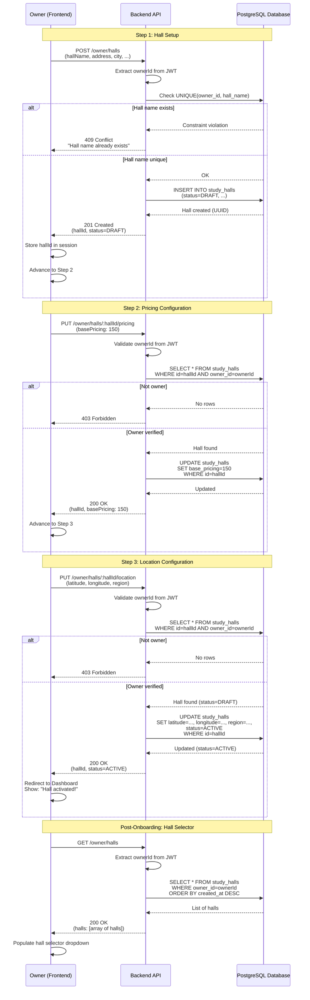
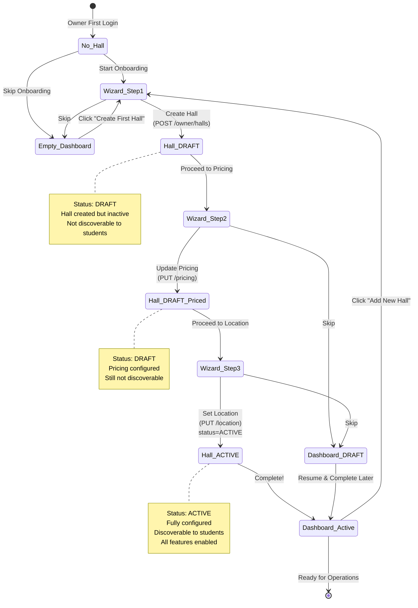
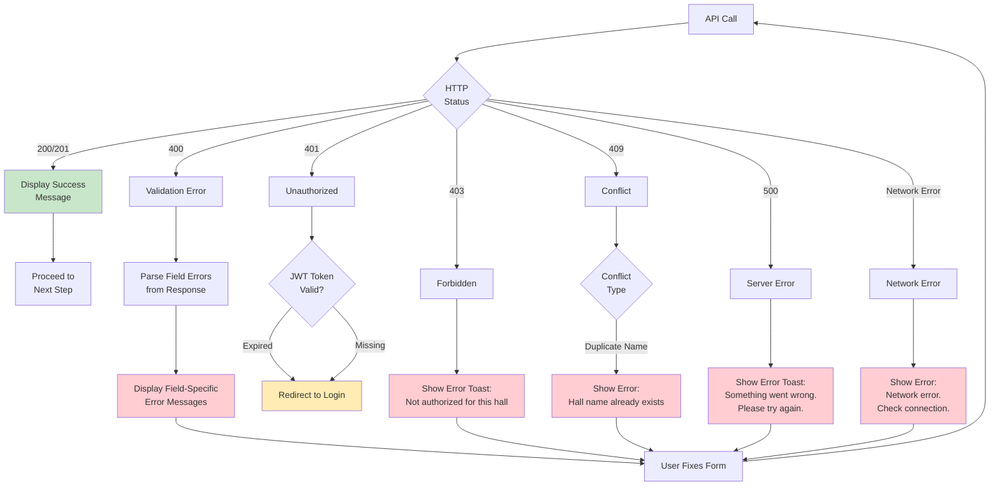
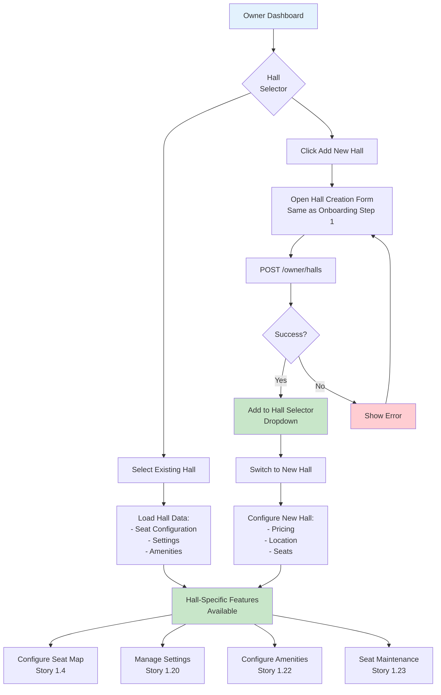
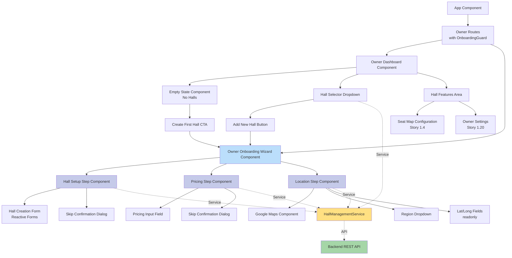
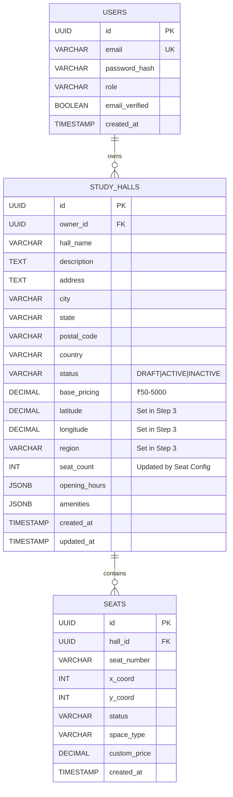
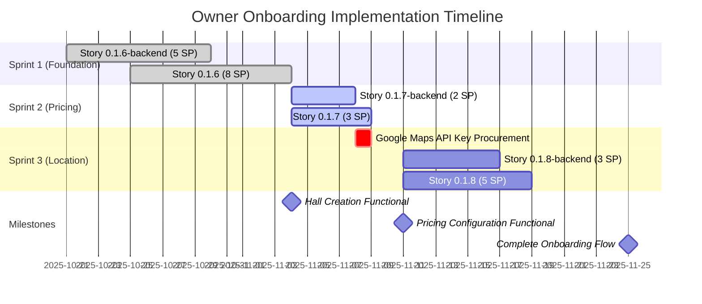

# Owner Onboarding Wizard Flow - Visual Documentation

**Epic:** Epic 0.1 - Authentication & Onboarding
**Features:** 0.1.6, 0.1.7, 0.1.8
**Created:** 2025-10-19

---

## Implementation Status

**Last Updated**: 2025-10-21
**Status**: 🔄 Partial Implementation (Component Ready, Integration In Progress)

- ✅ Wizard UI Component (OwnerOnboardingWizardComponent) - Complete
- ✅ Backend API Integration (HallManagementService) - Complete
- 🔄 Onboarding Guard & Routing (Task 14) - In Progress
- 🔄 Dashboard Empty State CTA (Task 7) - In Progress
- 🔄 Multi-Hall Support UI (Task 8) - In Progress
- 🔄 E2E Test Coverage (Task 12) - In Progress

**Diagrams Below**: Represent final intended behavior (not all flows active yet)

---

## Complete Onboarding Flow

```mermaid
flowchart TD
    Start([Owner First Login]) --> CheckOnboarding{Onboarding<br/>Completed?}

    CheckOnboarding -->|No| ShowWizard[Display Onboarding Wizard<br/>Step 1 of 3: Hall Setup]
    CheckOnboarding -->|Yes| Dashboard[Owner Dashboard]

    ShowWizard --> Step1[Step 1: Hall Setup Form]

    Step1 --> FillForm[Owner fills:<br/>- Hall Name*<br/>- Description<br/>- Address*<br/>- City*<br/>- State*<br/>- Postal Code<br/>- Country*]

    FillForm --> SkipCheck1{Skip or<br/>Create?}

    SkipCheck1 -->|Skip| ConfirmSkip1{Confirm Skip?}
    ConfirmSkip1 -->|Yes| EmptyDashboard[Dashboard with<br/>Empty State]
    ConfirmSkip1 -->|No| Step1

    SkipCheck1 -->|Create Hall| ValidateForm1{Form<br/>Valid?}

    ValidateForm1 -->|No| ShowErrors1[Display Validation Errors]
    ShowErrors1 --> Step1

    ValidateForm1 -->|Yes| CallAPI1[POST /owner/halls]

    CallAPI1 --> APICheck1{API<br/>Success?}

    APICheck1 -->|Error 400| ShowValidationError1[Show Backend<br/>Validation Error]
    ShowValidationError1 --> Step1

    APICheck1 -->|Error 409| ShowDuplicateError[Show: Hall name<br/>already exists]
    ShowDuplicateError --> Step1

    APICheck1 -->|201 Created| StoreHallID[Store Hall ID<br/>status=DRAFT]

    StoreHallID --> ShowSuccess1[Show Success Message:<br/>Hall created successfully!]

    ShowSuccess1 --> Step2[Step 2: Pricing Configuration]

    Step2 --> FillPricing[Owner sets:<br/>- Base Pricing ₹/hour<br/>Default: ₹100<br/>Range: ₹50 - ₹5000]

    FillPricing --> SkipCheck2{Skip or<br/>Continue?}

    SkipCheck2 -->|Skip| ConfirmSkip2{Confirm Skip?}
    ConfirmSkip2 -->|Yes| DashboardDraft[Dashboard<br/>Hall Status: DRAFT]
    ConfirmSkip2 -->|No| Step2

    SkipCheck2 -->|Continue| ValidatePricing{Pricing<br/>Valid?}

    ValidatePricing -->|No| ShowPricingError[Show: Pricing must be<br/>between ₹50 - ₹5000]
    ShowPricingError --> Step2

    ValidatePricing -->|Yes| CallAPI2["PUT /owner/halls/:hallId/pricing"]

    CallAPI2 --> APICheck2{API<br/>Success?}

    APICheck2 -->|Error 400| ShowValidationError2[Show Backend<br/>Validation Error]
    ShowValidationError2 --> Step2

    APICheck2 -->|200 OK| ShowSuccess2[Show Success Message:<br/>Pricing updated!]

    ShowSuccess2 --> Step3[Step 3: Location Configuration]

    Step3 --> LoadMap[Load Google Maps<br/>Map Picker UI]

    LoadMap --> SelectLocation[Owner selects:<br/>- Location via Map Click<br/>- Auto-populate Lat/Long<br/>- Select Region Dropdown]

    SelectLocation --> SkipCheck3{Skip or<br/>Complete?}

    SkipCheck3 -->|Skip| ConfirmSkip3{Confirm Skip?}
    ConfirmSkip3 -->|Yes| DashboardDraft
    ConfirmSkip3 -->|No| Step3

    SkipCheck3 -->|Complete Setup| ValidateLocation{Location<br/>Valid?}

    ValidateLocation -->|No| ShowLocationError[Show: Location and<br/>Region required]
    ShowLocationError --> Step3

    ValidateLocation -->|Yes| CallAPI3["PUT /owner/halls/:hallId/location"]

    CallAPI3 --> APICheck3{API<br/>Success?}

    APICheck3 -->|Error 400| ShowValidationError3[Show Backend<br/>Validation Error]
    ShowValidationError3 --> Step3

    APICheck3 -->|200 OK| UpdateStatus[Backend Updates:<br/>status = ACTIVE]

    UpdateStatus --> ShowSuccess3[Show Success Message:<br/>Hall activated!<br/>Welcome to StudyMate]

    ShowSuccess3 --> DashboardActive[Owner Dashboard<br/>Hall Status: ACTIVE<br/>All Features Enabled]

    EmptyDashboard --> CTAButton[Create Your First Hall<br/>CTA Button]
    CTAButton --> ShowWizard

    DashboardActive --> HallSelector[Hall Selector Dropdown]
    DashboardActive --> ConfigureSeats[Configure Seat Map<br/>Story 1.4]
    DashboardActive --> ManageSettings[Manage Settings<br/>Story 1.20]
    DashboardActive --> ConfigureAmenities[Configure Amenities<br/>Story 1.22]

    HallSelector --> AddNewHall[Add New Hall Button]
    AddNewHall --> Step1

    style Start fill:#e1f5e1
    style Dashboard fill:#e3f2fd
    style EmptyDashboard fill:#fff3e0
    style DashboardDraft fill:#fff9c4
    style DashboardActive fill:#c8e6c9
    style CallAPI1 fill:#bbdefb
    style CallAPI2 fill:#bbdefb
    style CallAPI3 fill:#bbdefb
    style UpdateStatus fill:#a5d6a7
    style ShowSuccess1 fill:#c8e6c9
    style ShowSuccess2 fill:#c8e6c9
    style ShowSuccess3 fill:#81c784
    style ShowErrors1 fill:#ffcdd2
    style ShowValidationError1 fill:#ffcdd2
    style ShowPricingError fill:#ffcdd2
    style ShowValidationError2 fill:#ffcdd2
    style ShowLocationError fill:#ffcdd2
    style ShowValidationError3 fill:#ffcdd2
    style ShowDuplicateError fill:#ffcdd2
```



---

## Wizard Step Details

### Step 1: Hall Setup (Story 0.1.6)

**Purpose:** Create study hall with basic information

**Form Fields:**
- Hall Name* (required, max 255 chars)
- Description (optional, max 1000 chars)
- Address* (required, max 500 chars)
- City* (required, max 100 chars)
- State/Province* (required, max 100 chars)
- Postal Code (optional, max 20 chars)
- Country* (required, dropdown)

**Actions:**
- **Create Hall:** POST /owner/halls → Advances to Step 2
- **Skip for now:** Redirect to dashboard with empty state

**Backend:**
- Creates hall with status=DRAFT
- Validates hall name uniqueness per owner
- Returns hall ID for subsequent steps

---

### Step 2: Pricing Configuration (Story 0.1.7)

**Purpose:** Set base hourly pricing for the hall

**Form Fields:**
- Base Pricing ₹/hour (default: ₹100, range: ₹50 - ₹5000)

**Actions:**
- **Continue:** PUT /owner/halls/{hallId}/pricing → Advances to Step 3
- **Skip for now:** Redirect to dashboard (hall remains DRAFT)

**Backend:**
- Updates base_pricing column
- Validates pricing range (₹50 - ₹5000)
- Hall status remains DRAFT

---

### Step 3: Location Configuration (Story 0.1.8)

**Purpose:** Set hall location and activate for student discovery

**Form Fields:**
- Google Maps Map Picker (click to select location)
- Latitude (auto-populated, readonly)
- Longitude (auto-populated, readonly)
- Region Dropdown (North Zone, South Zone, East Zone, West Zone, Central)

**Actions:**
- **Complete Setup:** PUT /owner/halls/{hallId}/location → Activates hall, redirects to dashboard
- **Skip for now:** Redirect to dashboard (hall remains DRAFT)

**Backend:**
- Updates latitude, longitude, region columns
- **Changes hall status from DRAFT to ACTIVE**
- Makes hall discoverable to students

---

## User Journey Map

```mermaid
journey
    title Owner Onboarding Journey
    section Registration
      Sign up as Owner: 5: Owner
      Verify email: 4: Owner
      First login: 5: Owner
    section Step 1: Hall Setup
      View onboarding wizard: 5: Owner
      Fill hall information: 4: Owner
      Submit hall creation: 5: Owner
      See success message: 5: Owner
    section Step 2: Pricing
      View pricing form: 5: Owner
      Enter base pricing: 4: Owner
      Submit pricing: 5: Owner
      See success message: 5: Owner
    section Step 3: Location
      View Google Maps: 5: Owner
      Select hall location: 4: Owner
      Select region: 4: Owner
      Complete setup: 5: Owner
      Hall activated: 5: Owner
    section Post-Onboarding
      View dashboard: 5: Owner
      Configure seat map: 5: Owner
      Manage settings: 5: Owner
```

---

## API Sequence Diagram



---

## State Transition Diagram



---

## Error Handling Flow



---

## Multi-Hall Management Flow



---

## Component Hierarchy



---

## Database Schema Visualization



---

## Implementation Timeline (3 Sprints)



---

## Key Takeaways

### For Developers

1. **Backend First:** Always implement backend stories before corresponding frontend stories
2. **Data-Testid Mandatory:** Add data-testid attributes during component development (NOT during E2E testing)
3. **Real Authentication:** E2E tests MUST use real auth (loginAsOwnerAPI helper, NO mocks)
4. **Status Transitions:** Hall status changes DRAFT → ACTIVE automatically in Story 0.1.8-backend
5. **Multi-Hall Support:** Hall selector dropdown and "Add New Hall" button from Story 0.1.6

### For Product Owner

1. **Google Maps API:** Obtain API key BEFORE Sprint 3 starts (critical dependency)
2. **Sprint Dependencies:** Stories must be implemented sequentially (0.1.6 → 0.1.7 → 0.1.8)
3. **Testing Requirements:** 90%+ unit test coverage, 100% E2E pass rate (non-negotiable)
4. **Unblocks Features:** Completes onboarding, enables Story 1.4 and all hall-dependent features

### For QA

1. **Validation Report:** See `docs/qa/story-validation-report-onboarding-stories.md`
2. **Test Approach:** Unit + E2E + Integration + PostgreSQL MCP validation
3. **Anti-Patterns:** Review `docs/lessons-learned/e2e-testing-anti-patterns-*` before testing
4. **Definition of Done:** 14 pre-commit validation commands must return ZERO violations

---

**Diagram Created By:** Sarah (Product Owner)
**Date:** 2025-10-19
**Version:** 1.0
