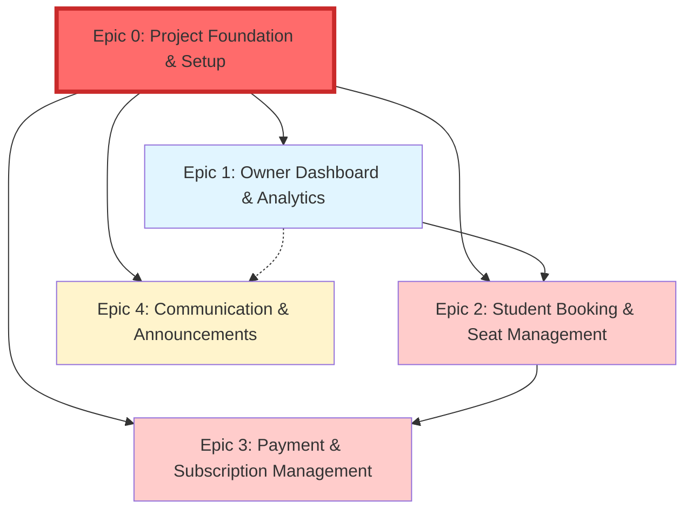

# StudyMate Stories & Epics

This directory contains all epics and user stories for the StudyMate project, derived from the [Product Requirements Document (PRD)](../prd.md).

---

## Epic Overview

The StudyMate MVP is organized into **5 core epics**, each representing a major functional area:

| Epic ID | Epic Name | Priority | Stories | Status |
|---------|-----------|----------|---------|--------|
| **EPIC-0** | [Project Foundation & Setup](./epic-0-project-foundation-setup.md) | Critical (FIRST) | 24 stories | Draft |
| **EPIC-1** | [Owner Dashboard & Analytics](./epic-1-owner-dashboard-analytics.md) | High | 14 stories | Draft |
| **EPIC-2** | [Student Experience & Booking Management](./epic-2-student-booking-seat-management.md) | Critical | 23 stories | Draft |
| **EPIC-3** | [Payment & Subscription Management](./epic-3-payment-subscription-management.md) | Critical | 10 stories | Draft |
| **EPIC-4** | [Communication & Announcements](./epic-4-communication-announcements.md) | Medium | 10 stories | Draft |

**Total Estimated Stories:** 81 stories across 5 epics

⚠️ **CRITICAL:** Epic 0 MUST be completed before any other epic begins.

---

## Epic Details

### Epic 0: Project Foundation & Setup ⚠️ **START HERE**
**Focus:** Establish complete technical foundation - project scaffolding, dev environment, database, authentication, and CI/CD.

**Features:**
- Feature 0.1: Frontend Project Scaffolding (Angular 20 + Tailwind CSS + NgRx)
- Feature 0.2: Backend Project Scaffolding (Spring Boot 3.5.6 + Java 17)
- Feature 0.3: Database Setup & Schema Initialization (PostgreSQL + Flyway)
- Feature 0.4: Development Environment Configuration
- Feature 0.5: Authentication & Authorization Framework (JWT + Spring Security)
- Feature 0.6: CI/CD Pipeline Basics (GitHub Actions)

**Key Technical Challenges:**
- Zero technical debt from start
- Consistent dev environment across team
- Secure authentication foundation
- Automated testing pipeline

**MUST COMPLETE FIRST** - All other epics depend on this foundation.

[View Epic Details →](./epic-0-project-foundation-setup.md)

---

### Epic 1: Owner Dashboard & Analytics
**Focus:** Enable owners to manage facilities efficiently through dashboards, analytics, user management, and configuration tools.

**Features:**
- Feature 1.1: Admin Dashboard (real-time metrics)
- Feature 1.2: Seat Map Configuration (drag-and-drop, shift management)
- Feature 1.3: User Management (student profiles, staff accounts, booking/attendance history)
- Feature 5.1: Performance Reports (PDF/Excel downloads)

**Key Technical Challenges:**
- Real-time data synchronization
- Interactive drag-and-drop interface
- User management with role-based access control
- Report generation performance

[View Epic Details →](./epic-1-owner-dashboard-analytics.md)

---

### Epic 2: Student Experience & Booking Management
**Focus:** Complete student experience including study hall discovery via Google Maps, personalized dashboard, profile management, settings, and seamless seat booking with automated attendance tracking.

**Features:**
- Feature 2.0: Study Hall Discovery & Search (Google Maps integration, location-based search, Airbnb-style interface)
- Feature 2.1: Student Dashboard (bookings, subscription status, attendance history)
- Feature 2.2: Student Profile Management (personal info, avatar upload)
- Feature 2.3: Student Settings & Preferences (notifications, account settings)
- Feature 2.4: Student Booking (interactive seat map, real-time availability)
- Feature 2.5: Check-in/Check-out (QR code-based attendance)

**Key Technical Challenges:**
- Google Maps JavaScript API integration with location-based search
- Geolocation services and distance calculations
- Real-time search filtering and sorting
- Image storage and CDN for hall images and avatars
- Preventing double-booking with seat locking
- Real-time WebSocket/polling for seat updates
- QR code security and validation
- ACID compliance for booking transactions

[View Epic Details →](./epic-2-student-booking-seat-management.md)

---

### Epic 3: Payment & Subscription Management
**Focus:** Instant payments, automated subscription tracking, and revenue optimization.

**Features:**
- Feature 2.2: Payment Integration (Razorpay/Stripe)
- Feature 4.1: Subscription Automation (expiry tracking, reminders, payment locks)

**Key Technical Challenges:**
- PCI compliance and secure payment handling
- Webhook signature verification
- Scheduled job execution for reminders
- Idempotent payment processing

[View Epic Details →](./epic-3-payment-subscription-management.md)

---

### Epic 4: Communication & Support
**Focus:** Instant announcements from owners to all students and comprehensive support system.

**Features:**
- Feature 6.1: Announcements (creation, publishing, student portal display)
- Feature 6.2: Contact Support & Help (contact form, FAQ, support tickets)

**Key Technical Challenges:**
- Real-time announcement delivery (WebSocket/SSE)
- Rich text editor integration
- Scalable announcement distribution
- Support ticket management and email notifications

[View Epic Details →](./epic-4-communication-announcements.md)

---

## Development Standards & Guidelines

All stories must adhere to the following standards:

### Frontend Development
- **Framework:** Angular 20 (TypeScript) with Tailwind CSS
- **Standards:** [Angular Coding Rules](../guidelines/coding-standard-guidelines/angular-rules.md)
- **UI/UX:** [UI/UX Design Best Practices](../guidelines/airbnb-inspired-design-system/index.md)
- **Design Reference:** [Front-End Specification](../guidelines/airbnb-inspired-design-system/index.md)

### Backend Development
- **Framework:** Spring Boot 3.5.6 (Java 17)
- **Standards:** [Java/Spring Boot Coding Rules](../guidelines/coding-standard-guidelines/java-spring-rules.md)
- **Architecture:** [System Architecture Blueprint](../architecture.md)

### Database
- **Database:** PostgreSQL
- **Access:** PostgreSQL MCP (DB: `studymate_user`, user: `studymate_user`, pwd: `studymate_user`)
- **Validation:** MANDATORY PostgreSQL MCP validation for all DB operations

### Testing
- **Browser Testing:** Playwright ([Playwright Rules](../guidelines/coding-standard-guidelines/playwright-rules.md))
- **Unit Testing:** [Unit Testing Guidelines](../guidelines/unit-testing-story-guidelines.md)
- **Test Coverage:** 90%+ compliance required
- **Console Check:** Zero browser console errors/warnings

### Documentation & Research
- **MANDATORY:** Use context7 MCP for version-specific docs (Angular 20, Java 17, Spring Boot 3.5.6)
- **Reference:** [Context7 MCP Guidelines](../guidelines/context7-mcp.md)

---

## Story Workflow

### 1. Story Creation
Stories are created from epics using the [story template](../../.bmad-core/templates/story-tmpl.yaml).

**Naming Convention:** `{epic_num}.{story_num}.{story-title-short}.md`

**Example:** `1.1.dashboard-overview.md`

### 2. Story Development
Development follows the defined workflow:
1. **Draft** → PO creates and validates story
2. **Approved** → Story ready for development
3. **InProgress** → Dev agent implements story
4. **Review** → QA agent validates implementation
5. **Done** → Story meets all acceptance criteria and testing standards

### 3. Story Validation
Each story must pass:
- ✅ All acceptance criteria met
- ✅ 90%+ test coverage
- ✅ Playwright tests passing (zero console errors)
- ✅ PostgreSQL MCP database validation
- ✅ Code review approval

---

## Epic Dependencies

**Legend:**
- **Red (Critical - FIRST):** Epic 0 - Foundation (BLOCKING)
- **Blue (High Priority):** Foundation features
- **Red (Critical Priority):** Core business functionality
- **Yellow (Medium Priority):** Communication enhancements

**MANDATORY Development Order:**
1. **Epic 0** (Project Foundation) - ⚠️ MUST COMPLETE FIRST - BLOCKING ALL OTHERS
2. **Epic 1** (Owner Dashboard) - Foundation and configuration
3. **Epic 2** (Student Booking) - Core booking functionality
4. **Epic 3** (Payment & Subscription) - Revenue generation
5. **Epic 4** (Communication) - Engagement features

---

## Success Metrics (MVP)

| Metric | Target | Epic |
|--------|--------|------|
| Seat Utilization Increase | 15% | Epic 1, Epic 2 |
| Admin Time Reduction | 50% | Epic 1 |
| On-time Payment Rate | 95% | Epic 3 |
| Booking Completion Time | <30 seconds | Epic 2 |
| Dashboard Load Time | <2 seconds | Epic 1 |
| Zero Double-Bookings | 100% | Epic 2 |

---

## Next Steps

1. **For PO:** Create individual stories from each epic using `*create-story` command
2. **For Dev Team:** Review epic technical requirements and architecture docs
3. **For QA Team:** Review testing requirements and prepare test environments
4. **For Stakeholders:** Review and approve epic priorities and scope

---

## Change Log

| Date | Version | Description | Author |
|------|---------|-------------|--------|
| 2025-10-10 | 1.0 | Created 4 epics from PRD | Sarah (PO) |

---

## Quick Links

- [Product Requirements Document (PRD)](../prd.md)
- [System Architecture Blueprint](../architecture.md)
- [Front-End Specification](../guidelines/airbnb-inspired-design-system/index.md)
- [Guidelines Index](../guidelines/index.md)
- [Story Template](../../.bmad-core/templates/story-tmpl.yaml)
