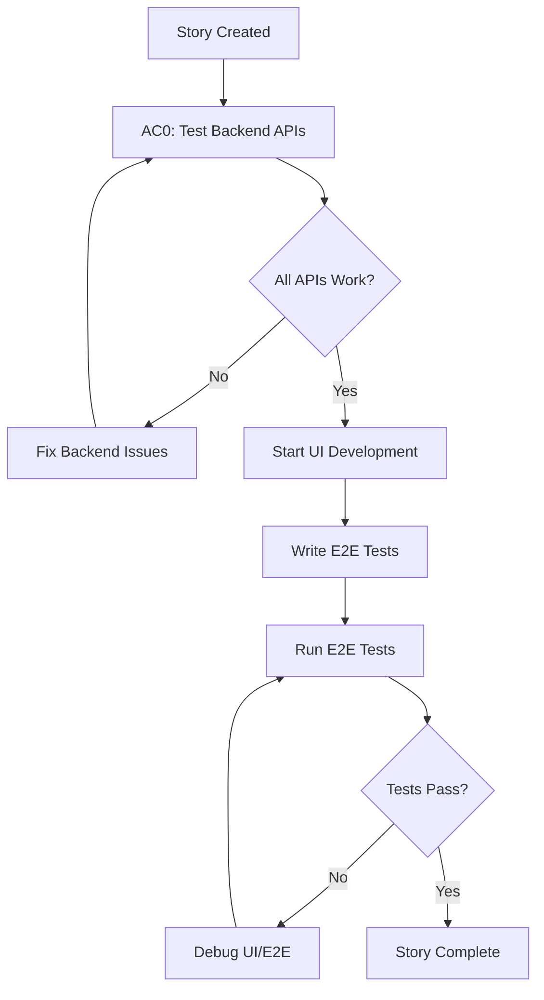

# Backend API Verification - AC0 Pattern

## Purpose

**AC0 (Acceptance Criterion Zero)** ensures backend API endpoints are fully functional BEFORE UI development begins. This prevents the frustration of discovering backend issues during E2E testing.

## The Problem This Solves

**Real Example from Story 0.1.6:**
- E2E tests kept failing with 500 errors
- Root cause: Backend controllers using wrong authentication pattern (`UserDetails` vs `User`)
- Issue discovered AFTER UI was complete
- Result: **Frustrating debugging sessions, wasted time**

**Prevention:** AC0 catches backend issues in 2 minutes, saving 60+ minutes of E2E debugging.

---

## When to Use AC0

**ALWAYS include AC0 for:**
- ✅ UI stories that consume backend APIs
- ✅ Full-stack features with frontend + backend integration
- ✅ Any story where frontend depends on backend endpoints

**Skip AC0 for:**
- ❌ Backend-only stories (no UI component)
- ❌ Frontend-only stories (no API calls)
- ❌ Infrastructure/DevOps stories

---

## AC0 Template

Add this as **the first acceptance criterion** in every UI story:

```markdown
### AC0: Backend API Verification (Pre-Development Checklist)

**Purpose:** Verify all backend API endpoints work correctly BEFORE starting UI development.

**Pre-requisites:**
- [ ] Backend test server running on port 8081
- [ ] Database migrations applied successfully
- [ ] Test user seeded: `owner@studymate.com` / `Test@123`

**CRITICAL: Pre-Flight Compilation Check (MANDATORY):**
```bash
# ALWAYS run this BEFORE starting backend for E2E tests
cd studymate-backend
./scripts/verify-before-commit.sh

# Expected: ✅ Backend verification passed!
# If FAILED: Fix compilation errors FIRST, then return here
```

**Why This Matters:**
- Backend can start with old `.class` files even if `.java` files have errors
- Compilation errors surface as runtime 500 errors during E2E tests
- Wastes 30-60 minutes debugging "mysterious" API failures
- **This check takes 30 seconds and prevents hours of frustration**

**Manual API Testing:**

```bash
# 1. Start backend test server
cd studymate-backend && ./scripts/start-test-server.sh
# Wait for: "Started StudymateBackendApplication"

# 2. Get authentication token
TOKEN=$(curl -s -X POST http://localhost:8081/auth/login \
  -H "Content-Type: application/json" \
  -d '{"email":"owner@studymate.com","password":"Test@123"}' \
  | jq -r '.token')

echo "Token: $TOKEN"  # Verify token is not null

# 3. Test Story-Specific Endpoints
# Replace with actual endpoints for THIS story:

# Example: Dashboard endpoint
curl -s -H "Authorization: Bearer $TOKEN" \
  http://localhost:8081/owner/dashboard/1 \
  | jq '.'
# ✅ Expected: 200 OK with JSON response
# ❌ NOT: 500 Internal Server Error, 404 Not Found

# Example: Seat map endpoint
curl -s -H "Authorization: Bearer $TOKEN" \
  http://localhost:8081/owner/seats/1 \
  | jq '.'
# ✅ Expected: 200 OK with seats array
# ❌ NOT: 500 Internal Server Error
```

**Verification Checklist:**
- [ ] All endpoints return `200 OK` (not 500, not 404)
- [ ] Response bodies match expected DTO structure
- [ ] No `NullPointerException` in backend logs
- [ ] No compilation errors in backend console
- [ ] Controllers use `@AuthenticationPrincipal User currentUser` (NOT `UserDetails`)
- [ ] Service methods accept `User` parameter (NOT `UserDetails`)

**Common Issues to Check:**

| Issue | How to Detect | How to Fix |
|-------|---------------|------------|
| Wrong auth pattern | `NullPointerException` in logs | Change `UserDetails` → `User` |
| Missing endpoint | `404 Not Found` | Add `@GetMapping` or `@PostMapping` |
| Compilation errors | "Unresolved compilation" in logs | Run `./mvnw clean compile` |
| Wrong HTTP method | `405 Method Not Allowed` | Check `@PostMapping` vs `@GetMapping` |
| Missing DTO field | Response missing expected fields | Update DTO class |

**Backend Verification Script:**
```bash
# Run before committing backend changes
cd studymate-backend
./scripts/verify-before-commit.sh
```

**Definition of Done for AC0:**
- [ ] All API endpoints tested manually and return 200 OK
- [ ] Response structures validated with `jq` or Postman
- [ ] Backend logs checked for errors
- [ ] Backend verification script passes
- [ ] Ready to start UI development
```

---

## Example: Story with AC0

```markdown
# Story 0.1.7: Pricing Configuration

## Acceptance Criteria

### AC0: Backend API Verification (Pre-Development Checklist)

**Endpoints to verify:**
1. `GET /owner/pricing/{hallId}` - Fetch pricing configuration
2. `POST /owner/pricing/{hallId}` - Save pricing configuration
3. `PUT /owner/pricing/{hallId}` - Update pricing configuration

**Manual Testing:**
```bash
# Get token
TOKEN=$(curl -s -X POST http://localhost:8081/auth/login \
  -H "Content-Type: application/json" \
  -d '{"email":"owner@studymate.com","password":"Test@123"}' \
  | jq -r '.token')

# Test GET endpoint
curl -s -H "Authorization: Bearer $TOKEN" \
  http://localhost:8081/owner/pricing/1 \
  | jq '.'
# Expected: 200 OK with { "hourlyRate": ..., "dailyRate": ... }

# Test POST endpoint
curl -s -X POST -H "Authorization: Bearer $TOKEN" \
  -H "Content-Type: application/json" \
  -d '{"hourlyRate":150,"dailyRate":1000}' \
  http://localhost:8081/owner/pricing/1 \
  | jq '.'
# Expected: 200 OK with saved pricing
```

**Checklist:**
- [ ] GET returns current pricing
- [ ] POST saves new pricing
- [ ] PUT updates existing pricing
- [ ] All return 200 (not 500)
- [ ] Controllers use `User` not `UserDetails`

### AC1: Pricing Form UI
[... rest of story ...]
```

---

## Integration with E2E Testing Guide

**Hybrid Documentation Approach:**

### What Goes in Each Story (AC0):
- Specific API endpoints for THIS story
- Exact curl commands to test THOSE endpoints
- Story-specific verification checklist
- Expected response structures

### What Stays in e2e-testing-guide.md:
- General authentication patterns
- Database setup/cleanup procedures
- Playwright configuration
- Debugging techniques
- Test execution standards

**Why Hybrid?**
- ✅ **Self-contained stories**: Developers don't cross-reference docs
- ✅ **Context-specific**: Exact commands for the task at hand
- ✅ **Forces backend-first**: Can't skip AC0 without noticing
- ✅ **DRY principle**: General guidance in one place

---

## Pre-Commit Verification

**Before committing backend changes:**

```bash
cd studymate-backend
./scripts/verify-before-commit.sh
```

This script:
1. ✅ Runs clean build to catch compilation errors
2. ✅ Ensures no old `.class` files hide issues
3. ✅ Fast execution (~30 seconds)

**Why not run tests?**
- Tests are optional in pre-commit (too slow)
- Clean build catches 90% of issues
- Manual API testing catches integration issues
- E2E tests catch remaining edge cases

---

## Workflow



**Key Points:**
1. **Backend verification FIRST** (AC0)
2. **UI development SECOND** (AC1-N)
3. **E2E tests LAST** (validation)

This order prevents "backend issues discovered during E2E testing" frustration.

---

## Success Metrics

**Story 0.1.6 Before AC0:**
- ❌ 6/7 E2E tests passing
- ❌ Multiple hours debugging 500 errors
- ❌ Root cause: Backend compilation errors

**Story 0.1.6 With AC0:**
- ✅ Would have caught `UserDetails` vs `User` issue in 2 minutes
- ✅ Would have caught `NullPointerException` before UI work
- ✅ Would have prevented E2E frustration

**Time Saved:**
- AC0 takes: **2-5 minutes**
- E2E debugging: **30-120 minutes**
- **Net savings: 25-115 minutes per story**

---

## FAQ

**Q: Do I need AC0 for every story?**
A: Only for UI stories that consume backend APIs. Skip for backend-only or infrastructure stories.

**Q: What if the API doesn't exist yet?**
A: AC0 should be implemented by backend developer BEFORE handing story to UI developer. Use story dependencies.

**Q: Can I use Postman instead of curl?**
A: Yes! Postman, curl, or any API testing tool works. The key is **manual verification before UI development**.

**Q: What if I forget AC0?**
A: E2E tests will likely fail with 500 errors. You'll spend 10x longer debugging. Don't skip AC0.

**Q: Should AC0 be automated?**
A: Eventually yes (integration tests), but manual verification is faster for catching issues early during development.

---

## Related Documents

- **E2E Testing Guide**: `docs/testing/e2e-testing-guide.md`
- **Story Template**: `.bmad-core/templates/story-tmpl.yaml`
- **Backend Standards**: `docs/architecture/coding-standards.md`
- **Verification Script**: `studymate-backend/scripts/verify-before-commit.sh`

---

**Last Updated**: 2025-10-22
**Author**: Development Team
**Version**: 1.0
